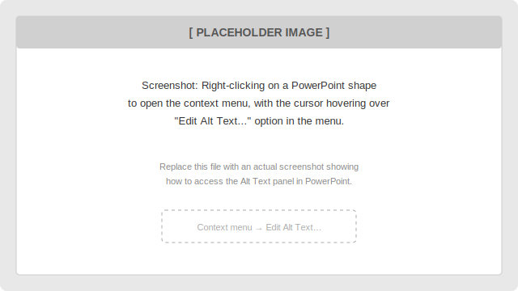
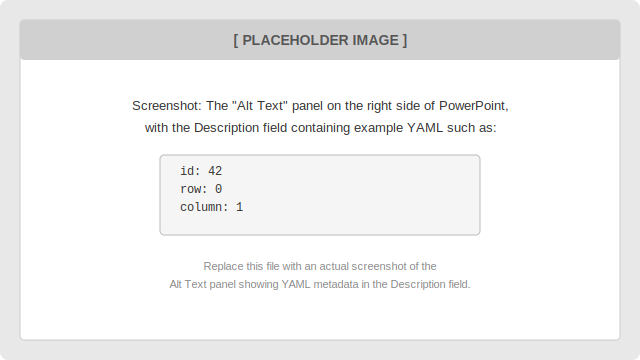
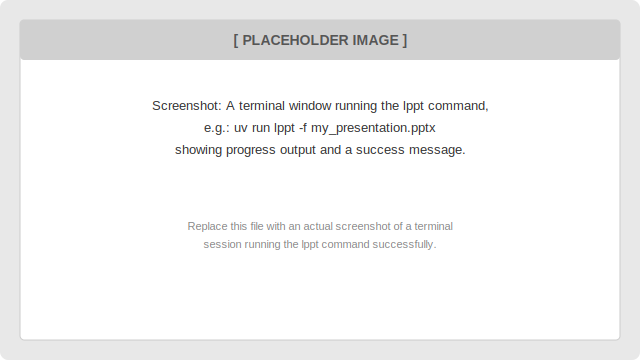
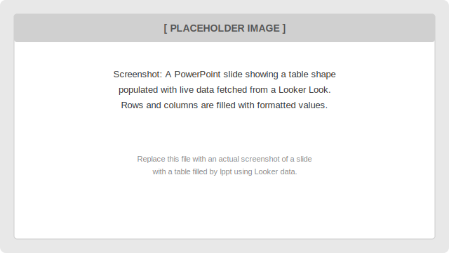
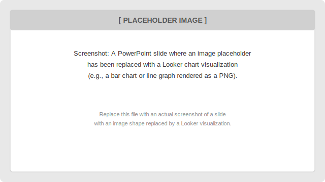
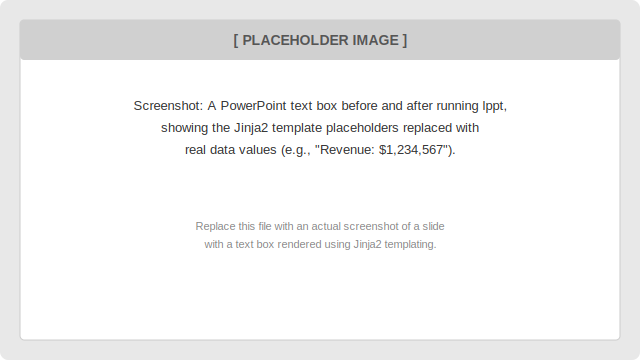

Getting Started: Creating Your Presentation
============================================

This guide walks business users and analysts through creating a PowerPoint presentation
that automatically pulls live data from Looker. No coding required — just a few lines
of YAML in a shape's Alt Text field, and the ``lppt`` tool does the rest.

.. contents:: On this page
   :local:
   :depth: 2

Overview
--------

The **Looker PowerPoint CLI** (``lppt``) works by reading a standard ``.pptx`` file,
locating any shapes that have a special YAML snippet in their **Alt Text** description,
fetching the corresponding data from Looker, and writing the results back into a new
copy of the presentation.

You design your slides in PowerPoint as you normally would — adding tables, images,
and text boxes wherever you want data to appear. The only extra step is setting a small
block of YAML in the **Alt Text** panel for each shape that should be populated by Looker.

.. note::

   Before following the steps below, make sure ``lppt`` is installed and your Looker
   credentials are configured.  See :doc:`cli` for environment-variable details and
   the :ref:`quick-start` section on the home page for installation instructions.

Prerequisites
-------------

* A PowerPoint file (``.pptx``) — new or existing.
* Your Looker **Look ID** (the numeric ID shown in the Looker URL when you open a Look,
  e.g. ``https://your-company.looker.com/looks/42`` → ID is ``42``).
* ``lppt`` installed and Looker credentials set (see :doc:`cli`).

.. _adding-alt-text:

Step 1 — Open the Alt Text panel
---------------------------------

In PowerPoint, every shape has an **Alt Text** field. This is normally used to describe
images for screen readers, but ``lppt`` uses the *Description* box to read YAML
configuration.

To open the Alt Text panel:

1. **Right-click** on the shape (table, image, text box, or chart).
2. Choose **"Edit Alt Text…"** from the context menu.

   *Replace this placeholder with a screenshot: right-clicking a shape in PowerPoint
   to open the context menu, with "Edit Alt Text…" highlighted.*

The **Alt Text** panel opens on the right side of the screen. You will see two fields:
**Title** and **Description**. Leave the *Title* field empty — enter all your YAML
configuration in the **Description** field only.

   *Replace this placeholder with a screenshot: the Alt Text panel open in PowerPoint
   with example YAML entered in the Description box.*

Step 2 — Write your YAML configuration
---------------------------------------

The YAML you enter tells ``lppt`` which Looker Look to fetch and how to display the
results. The only **required** field is ``id`` — the Look ID.

The simplest possible configuration is:

.. code-block:: yaml

   id: 42

Paste this into the **Description** field of the Alt Text panel and save. That is all
you need to get started. See :ref:`configuration-patterns` below for more complex
examples.

Step 3 — Run the tool
----------------------

Once you have saved your PowerPoint file with YAML in the Alt Text fields, open a
terminal in the folder containing the file and run:

.. code-block:: bash

   uv run lppt -f my_presentation.pptx

``lppt`` will:

1. Open ``my_presentation.pptx``.
2. Find all shapes with valid YAML in their Alt Text.
3. Fetch the corresponding data from Looker.
4. Write the data into the shapes.
5. Save a new file (e.g. ``my_presentation_2025-01-15.pptx``) in the same folder.

   *Replace this placeholder with a screenshot of a terminal session running
   ``uv run lppt -f my_presentation.pptx`` and showing success output.*

The original file is **never modified** — ``lppt`` always writes to a new output file.
Use ``--self`` / ``-s`` if you want to overwrite the original instead.

For full CLI options, see :doc:`cli`.

.. _configuration-patterns:

Configuration Patterns
----------------------

The sections below show the most common ways to configure a shape using YAML.
For a complete reference of every available field, see :doc:`models`.

Pattern 1 — Populate a table with all results
~~~~~~~~~~~~~~~~~~~~~~~~~~~~~~~~~~~~~~~~~~~~~~

**Use this when:** You have a PowerPoint **table** shape and want it filled with all
rows and columns from a Look.

.. code-block:: yaml

   id: 42

Add this YAML to the Alt Text of a table shape. ``lppt`` will fill the table with the
results, using the first row as the header and subsequent rows as data rows.

.. tip::

   Make your table large enough to hold the expected number of rows and columns.
   Extra rows are left blank; if the data exceeds the table size, rows are truncated.

   *Replace this placeholder with a screenshot: a PowerPoint slide with a table
   shape populated with live Looker data after running lppt.*

Pattern 2 — Extract a single value (row and column selection)
~~~~~~~~~~~~~~~~~~~~~~~~~~~~~~~~~~~~~~~~~~~~~~~~~~~~~~~~~~~~~

**Use this when:** You want to show a single metric value inside a text box, title, or
a small single-cell table.

``row`` and ``column`` are both **0-indexed** (first row = 0, first column = 0).

.. code-block:: yaml

   id: 42
   row: 0
   column: 1

This fetches the value from the first data row (``row: 0``) and the second column
(``column: 1``) of Look 42.

Pattern 3 — Select a value by column label
~~~~~~~~~~~~~~~~~~~~~~~~~~~~~~~~~~~~~~~~~~

**Use this when:** You want to pick a value by the **column name** rather than its
position. This is more robust if the column order in the Look might change.

.. code-block:: yaml

   id: 42
   row: 0
   label: "Total Revenue"

The ``label`` value must exactly match the column header label defined in Looker
(including capitalization and any special characters).

Pattern 4 — Embed a Looker chart as an image
~~~~~~~~~~~~~~~~~~~~~~~~~~~~~~~~~~~~~~~~~~~~~

**Use this when:** You have an **image placeholder** in your slide and want to replace
it with a Looker visualization rendered as a picture.

Insert any image into your slide (even a blank placeholder image), set it to the size
you want, then add the following YAML to its Alt Text:

.. code-block:: yaml

   id: 42
   result_format: png

``lppt`` will render the Look as a PNG and resize it to fit the shape's dimensions.
You can also specify explicit pixel dimensions:

.. code-block:: yaml

   id: 42
   result_format: png
   image_width: 1200
   image_height: 675

   *Replace this placeholder with a screenshot: a PowerPoint slide with an image
   shape replaced by a Looker visualization after running lppt.*

Pattern 5 — Populate a text box with templated values
~~~~~~~~~~~~~~~~~~~~~~~~~~~~~~~~~~~~~~~~~~~~~~~~~~~~~~

**Use this when:** You have a **text box** (or slide title) containing Jinja2 template
syntax that you want to fill with Looker data.

First, write your text box content using Jinja2 double-brace syntax, for example::

   Monthly Revenue: {{ header_rows[0].total_revenue }}
   vs Last Month: {{ header_rows[0].revenue_change }}

Then set the Alt Text of that text box to:

.. code-block:: yaml

   id: 42

``lppt`` will render the Jinja2 template using the Look's results, replacing the
``{{ ... }}`` placeholders with actual values.

   *Replace this placeholder with a screenshot: a PowerPoint text box before and
   after running lppt, with template placeholders replaced by real Looker values.*

.. note::

   Column names in templates are derived from the Look's column labels: lowercased
   and spaces replaced with underscores. For example, ``"Total Revenue"`` becomes
   ``total_revenue``. See :doc:`templating` for the full Jinja context reference.

Pattern 6 — Color-code numbers with Jinja2 filters
~~~~~~~~~~~~~~~~~~~~~~~~~~~~~~~~~~~~~~~~~~~~~~~~~~~~

**Use this when:** You want numbers to automatically appear **green** (positive) or
**red** (negative) in your text box.

In your text box, use the ``colorize_positive`` filter:

.. code-block:: jinja

   Growth Rate: {{ header_rows[0].growth_rate | colorize_positive }}

You can also customize the colors:

.. code-block:: jinja

   Change: {{ header_rows[0].change | colorize_positive(positive_hex="#0070C0", negative_hex="#C00000") }}

See :doc:`templating` for all available Jinja2 variables and filters.

Pattern 7 — Filter results dynamically
~~~~~~~~~~~~~~~~~~~~~~~~~~~~~~~~~~~~~~~

**Use this when:** You want to run the same presentation for different regions,
products, or time periods without editing it each time.

Add a ``filter`` field pointing to a Looker dimension:

.. code-block:: yaml

   id: 42
   filter: "orders.region"

Then pass the filter value at run time using the ``--filter`` CLI argument:

.. code-block:: bash

   uv run lppt -f my_presentation.pptx --filter "Europe"

This runs Look 42 filtered to rows where ``orders.region = "Europe"``.

You can also hard-code static filter overrides that always apply:

.. code-block:: yaml

   id: 42
   filter_overwrites:
     orders.status: "complete"
     orders.region: "EMEA"

Pattern 8 — Apply Looker formatting
~~~~~~~~~~~~~~~~~~~~~~~~~~~~~~~~~~~~~

**Use this when:** You want Looker to format values (e.g. currency symbols, percentage
signs, thousands separators) exactly as configured in your Looker model.

.. code-block:: yaml

   id: 42
   apply_formatting: true

When ``apply_formatting`` is ``true``, ``lppt`` asks Looker to return pre-formatted
strings (e.g. ``"$1,234,567"`` instead of ``1234567``). This is especially useful for
table shapes.

Pattern 9 — Retry on failure
~~~~~~~~~~~~~~~~~~~~~~~~~~~~~~

**Use this when:** You are working with large or slow Looker queries that occasionally
time out.

.. code-block:: yaml

   id: 42
   retries: 3

``lppt`` will retry the Looker API request up to 3 times before marking the shape as
failed.

Pattern 10 — Gemini LLM text synthesis
~~~~~~~~~~~~~~~~~~~~~~~~~~~~~~~~~~~~~~~

**Use this when:** You want a text box populated with an AI-generated summary or
analysis, rather than raw values.

This feature uses Google Gemini to synthesise text.  It **only works for text
box shapes** (``TEXT_BOX``, ``TITLE``, ``AUTO_SHAPE``).  Applying it to a table,
image, or chart shape will log a warning and skip that shape.

**Step 1 — Define one or more meta looks (optional)**

Add meta-look shapes to your presentation for each dataset you want Gemini to
analyse.  Set the shape's Alt Text to:

.. code-block:: yaml

   id: 42
   meta: true
   meta_name: sales_data

The ``meta_name`` value (``sales_data`` here) is the key you will reference from
the Gemini shape.  Meta-look shapes are removed from the output slide; their data
is only used as context.

**Step 2 — Configure the Gemini text box**

Add a text box to your slide and set its Alt Text to:

.. code-block:: yaml

   type: gemini
   prompt: Summarise the top three sales trends and highlight any risks.
   contexts:
     - sales_data

**The ``contexts`` list — unified context framework**

Each entry in ``contexts`` is resolved in order and passed to Gemini as a
labelled section.  Four types of entry are supported:

.. list-table::
   :header-rows: 1
   :widths: 20 80

   * - Entry
     - What it provides
   * - ``self``
     - The shape's own current text (before synthesis).
   * - ``slide_self``
     - Text of all other shapes on the same slide after Looker data has been
       rendered.  Gives the model awareness of what the slide is about.
   * - ``gemini_<id>``
     - The synthesised output of another Gemini text box whose ``gemini_id``
       is ``<id>`` (see chaining below).
   * - anything else
     - Treated as the ``meta_name`` of a Looker meta-look shape; its
       pre-fetched data is formatted as a readable table.

Example combining all four types:

.. code-block:: yaml

   type: gemini
   gemini_id: summary
   prompt: Write a one-paragraph executive summary.
   contexts:
     - slide_self          # what the slide says
     - sales_data          # Looker data
     - gemini_analysis     # output of another Gemini box
     - self                # current placeholder text as additional hint

**Chaining Gemini boxes**

Gemini boxes can reference each other.  A box with ``gemini_id: analysis``
(stored as ``gemini_analysis`` — the prefix is added automatically) can be
used as context by another box:

.. code-block:: yaml

   # Box 1 — data analysis
   type: gemini
   gemini_id: analysis          # stored as gemini_analysis
   prompt: Analyse the revenue data and list the top three trends.
   contexts:
     - revenue_data

.. code-block:: yaml

   # Box 2 — executive summary that builds on Box 1
   type: gemini
   gemini_id: summary           # stored as gemini_summary
   prompt: Write a concise executive summary based on the analysis.
   contexts:
     - slide_self
     - gemini_analysis          # Box 1's output

``lppt`` automatically detects these dependencies and processes boxes in the
correct topological order.  Circular references are detected and reported as
an error.

.. note::

   The ``gemini_`` prefix is added to ``gemini_id`` values automatically.
   ``gemini_id: analysis`` and ``gemini_id: gemini_analysis`` are equivalent.
   Always use the full ``gemini_<id>`` form when referencing a box in ``contexts``.

**Optional fields:**

.. code-block:: yaml

   type: gemini
   prompt: Summarise in one sentence.
   contexts:
     - sales_data
   model: gemini-1.5-pro   # default: gemini-2.0-flash

**Step 3 — Install the LLM extra and set your API key**

.. code-block:: bash

   pip install "looker_powerpoint[llm]"

Then set your Gemini API key:

.. code-block:: bash

   export GOOGLE_API_KEY="your-api-key"

**Step 4 — Run ``lppt`` as usual**

.. code-block:: bash

   uv run lppt -f my_presentation.pptx

``lppt`` will fetch the meta looks, call Gemini with the assembled context and
your prompt, and replace the text box content with the AI-generated response
while preserving the original font and paragraph styling.

.. note::

   If ``google-genai`` is not installed, ``lppt`` still runs normally for all
   other shapes; Gemini synthesis shapes are skipped with a warning.
   This means the package works without the LLM extra installed.

.. tip::

   If Gemini synthesis fails (e.g. bad API key, quota exceeded), ``lppt`` writes
   the error message into the text box and draws a red outline around it — the
   same behaviour as other shape errors.  Use ``--hide-errors`` to suppress the
   outline.

----

Troubleshooting
---------------

**Shape outlined in red after running lppt**
   ``lppt`` draws a red circle around any shape it could not populate. This usually
   means the Look ID is wrong, the query returned no data, or a column/row index is
   out of range.  Run with ``--verbose`` (or ``-vvv``) to see detailed error messages.
   Use ``--hide-errors`` to suppress the red outlines in the output file.

   For Gemini shapes specifically, the error message is also written into the text box
   so you can see exactly what went wrong without needing verbose logging.

**Nothing happened to my shape**
   Make sure your YAML is in the **Description** field of Alt Text (not the *Title*
   field), and that it is valid YAML.  You can validate YAML at
   `yaml-online-parser.appspot.com <https://yaml-online-parser.appspot.com/>`_.

**Wrong column values**
   Column names in templates are lowercased with spaces replaced by underscores.
   Open the Look in Looker and check the exact column label. If in doubt, use
   index-based access: ``{{ indexed_rows[0][0] }}``.

**Gemini synthesis shape is skipped with a warning**
   Make sure ``google-genai`` is installed (``pip install looker_powerpoint[llm]``),
   ``GOOGLE_API_KEY`` or ``GEMINI_API_KEY`` is set, and ``type: gemini`` is set in the
   **Description** field (not *Title*).

**Context data not found**
   ``lppt`` logs a warning for each ``contexts`` entry it cannot resolve.
   Check that meta-look ``meta_name`` values and ``gemini_<id>`` references
   exactly match the corresponding shapes in the presentation.

**Circular dependency in Gemini boxes**
   If ``lppt`` reports a circular dependency error, check the ``contexts`` lists
   of your Gemini boxes for cycles (e.g. A → B → A).

----

Next Steps
----------

* :doc:`templating` — Full reference for Jinja2 variables and the ``colorize_positive``
  filter.
* :doc:`models` — Complete field reference for the ``LookerReference`` and
  ``GeminiConfig`` YAML schemas.
* :doc:`cli` — All CLI flags, environment variables, and advanced options.
* :doc:`api` — Auto-generated API reference for developers.
